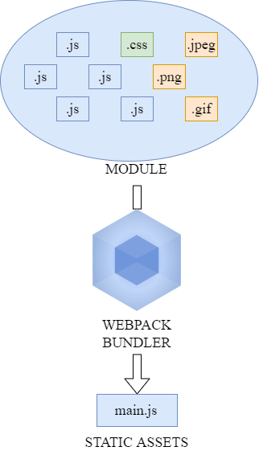

+++
title = "Webpack loaderを理解りたい"
outputs = ["Reveal"]
[reveal_hugo]
theme = "moon"
slide_number = true
[markup.highlight]
codeFences = false
+++

### Webpack loader を<span style="color :#FF8C00;">理解り</span> たい

2022-04-09 (Sun)

_@denham95173179_

---

### 事の運び

JS のフレームワークを使っていて、ビルド周りを雰囲気でやっていることに気づく

---

```sh
vue-cli
```

とか

```sh
create-react-app
```

に頼りきってた

---

そろそろ Webpack を<span style="color :#FF8C00;"><ruby>理解<rp>（</rp><rt>わか</rt><rp>）</rp></ruby>り</span>たい

---

### そもそも Webpack とは？

- ファイル(モジュール)を束ねる(bundle)するツール
- Web アプリケーションを構成するモジュール(JS のソースコード、スタイルシート、画像ファイル(.png や.jpeg や.gif))を 1 つ以上のバンドルにまとめる

---



---

### モジュールバンドラを使うと嬉しいこと

1. 自動的に依存関係を解決する
2. リクエストの回数を抑える
3. 大規模開発に向いている

---

### 1. 自動的に依存関係を解決する

---

### 旧来の JS

```html
<!DOCTYPE html>
<html>
  <head>
    <meta charset="utf-8" />
    <title>依存関係未解決パターン</title>
  </head>
  <body>
    <script src="js/libs/lib.js"></script>
    <script src="js/libs/axios.js"></script>
    <script src="js/app.js"></script>
  </body>
</html>
```

app.js の実行には lib.js,axios.js というライブラリが必要なため、この順に読み込まれる必要がある

---

### モジュールバンドラの登場

一方でモジュールバンドラを使うと、依存関係を解決したファイルを出力してくれるため

---

```html
<!DOCTYPE html>
<html>
  <head>
    <meta charset="utf-8" />
    <title>依存関係解決パターン</title>
  </head>
  <body>
    <script src="js/bundle.js"></script>
  </body>
</html>
```

これだけでアプリケーションが動作する！

---

### まとめると

- 複数の JS コードの依存関係を自動で解析し、ひとつのファイルにしてくれる
- HTML 側ではコードの依存関係を意識することなく、まとめられたファイルをインポートするだけでアプリがそのまま動作する

<aside class="notes">
Vue.js などの JS フレームワークは複数のライブラリから成り立っています。
このようにライブラリの依存関係が肥大化するほど、開発者が依存関係を意識してページを記述するのは困難になります。
そもそも、JS の依存関係を HTML 側で意識しなければならない状態は避けたいです。
</aside>

---

### 2. リクエストの回数を抑える

---

- ウェブブラウザとサーバーは**HTTP/1.1**という通信プロトコルで通信をしている

- HTTP1.1 環境 ではブラウザ/サーバー間の同時接続数が制限される(一度に処理できるリクエストの数に制限がある)ことから、複数ファイルのダウンロードは非効率的

---

**そもそものリクエスト数を減らす**ことで転送効率が向上する

---

### 3. 大規模開発に向いている

---

モジュールバンドラーを前提とすることで、コードはクラス・関数単位でファイルを分割できる。これによって下記のようなメリットがある

- 可読性の向上
- 名前空間の明確な分離
- モジュールの再利用性の向上

<aside class="notes">
Webpackは分割したそれぞれのファイルに名前空間を生成するので、変数の競合やグローバル汚染を防ぎます。
モジュールの再利用が可能となれば、複数のファイルに同じロジックを書くような状況が減らせます。
依存関係を気にしなくていいので、変更が起こった際も1つのモジュールを更新するだけでよくなります。
</aside>

---

### なぜ Webpack なの？

---

### さまざまなモジュール形式に対応しているため

- CommonJS
- AMD
- ES Modules

<aside class="notes">
Browserify や RequireJS などのモジュールバンドラーは特定のモジュール形式をサポートします。
一方、Webpack であれば過去のモジュール資産を活用できる。
</aside>

---

### ローダー・プラグインが豊富であるため

<aside class="notes">
プラグインを活用することでコードの圧縮(minify)など Webpack そのものを拡張可できます。
</aside>

---

### フレームワークでの活用実績が豊富であるため

- Vue.js
- React.js
- Angular.js
  etc

---

### Core Concepts

- **Entry**
- **Output**
- **Loader**
- **Plugins**
- Mode
- Browser Compatibility

<aside class="notes">
重要なのは上4つ
</aside>

---

### Loader

<aside class="notes">
Webpackを学ぶこと=Loderを学ぶこと、といっても過言ではないです。
今回は、このLoaderについてお話したいと思います。
</aside>

---

**Loader** はリソースをモジュールに変換する

---

css-loader,style-loader,ts-loader など

<aside class="notes">
Webpack はデフォルトで JS ファイルと JSON ファイルのみをバンドルします
</aside>

---

### ts-loader の導入

---

### コンセプト

create react app を使わず React+TypeScript 環境を*最小構成*{style=color:#FF8C00;} で構築する

---

### 構成

```sh
.
├── index.html
├── package.json
├── src
│   ├── Hello.tsx
│   └── index.tsx
├── tsconfig.json
├── webpack.config.development.js
└── webpack.config.production.js

```

---

```js
node
v14.17.6

webpack
v5.71.0

webpack-cli
v4.9.2
```

---

```sh
$ mkdir minimum-react-ts-sample
// webpack v5と必要なもの一式をインストール
$ npm install webpack webpack-cli --save-dev
// TypeScriptをインストール
$ npm install typescript --save-dev
// ts-loaderをインストール
$ npm install ts-loader --save-dev
// Reactをインストール
$ npm install react react-dom
// Reactの型定義をインストール
$ npm install --save @types/react @types/react-dom
```

---

```sh
+ webpack-cli@4.9.2
+ webpack@5.71.0
+ typescript@4.6.3
+ ts-loader@9.2.8
+ react@18.0.0
+ react-dom@18.0.0
+ @types/react@17.0.43
+ @types/react-dom@17.0.14
```

---

```sh
$ ls
node_modules  package-lock.json
```

---

webpack.js を作成する

```sh
touch webpack.config.development.js
touch webpack.config.production.js
```

---

### 最もシンプルな状態

```js
module.exports = {};
```

この中のプロパティに値を設定していく

---

### tsconfig.json を作成する

```sh
$ ./node_modules/.bin/tsc --init

Created a new tsconfig.json with:

  target: es2016
  module: commonjs
  strict: true
  esModuleInterop: true
  skipLibCheck: true
  forceConsistentCasingInFileNames: true


You can learn more at https://aka.ms/tsconfig.json
```

---

### オプションには 2 つのタイプが存在

- TypeScript のコンパイラオプション
  - TypeScript のオプションは tsconfig.json ファイルを使って設定する必要がある
- loader のプション
  - ローダーオプションは webpack の設定にある options プロパティで指定することがある

---

### TypeScript のコンパイラオプション の設定

---

### jsx に react を指定する

```js
// tsconfig.json
{
  "compilerOptions": {
    "jsx": "react",
  }
}
```

---

### ローダーオプションの設定

---

```json
// webpack.config.development.json
module.exports = {
  // エントリーポイント(バンドルの構築を開始する場所)を指定する。Webpackはこのファイルを基準に依存関係を解決していく。
  entry: "./src/index.tsx",
  // Webpackが作成したバンドルをどこに、どのような名前で出力するかを指定する
  output: {
    filename: "./dist/bundle.js",
  },
  // source-mapはdevelopmentmodeの場合のみ有効
  devtool: "source-map",
  resolve: {
    extensions: [".ts", ".tsx", ".js"],
  },
  module: {
    rules: [
      {
        // ローダーを使用することでデフォルトでは対応していないファイルをバンドル対象に加えることができる。testプロパティに変換したいファイルを指定する。
        test: /\.tsx?$/,
        loader: "ts-loader",
        options: {
          transpileOnly: true, // 型チェックを行わない。デフォルトはfalse
        },
      },
    ],
  },
};
```

---

### モード

パラメーターに`development`,`produciton`,`none`を与えることで、Webpack の設定を環境に応じて最適化できる

```json
module.exports = {
  // デフォルト値はproduction
  mode: 'production'
};
```

---

### package.json に追記する

```json
{
  "name": "minimum-react-typescript-sample",
  "version": "1.0.0",
  "scripts": {
    "build": "webpack --config ./webpack.config.development.js",
    "build-production": "webpack --config ./webpack.config.production.js",
    "type-check": "npx tsc -p . --noEmit" // typescript compilerを呼び出して型検査をするscriptを定義する。--noEmitオプションを付与すると、ファイルのoutputを行わずに型検査のみを実行する
  },
  "devDependencies": {
    "@types/react": "^17.0.43",
    "@types/react-dom": "^17.0.14",
    "ts-loader": "9.2.8",
    "typescript": "4.6.3",
    "webpack": "5.71.0",
    "webpack-cli": "^4.9.2"
  },
  "dependencies": {
    "react": "^18.0.0",
    "react-dom": "^18.0.0"
  }
}
```

---

### 怒られてみる

- Hello.tsx を下記のように書き換える

```js
import * as React from "react";

export interface Props {
  content: number; // number型にした
}

export default class MyComponent extends React.Component<Props, {}> {
  render() {
    return <div>{this.props.content}</div>;
  }
}
```

---

```sh
$ npm run type-check
```

---

### 怒られた

```sh
src/index.tsx:6:10 - error TS2769: No overload matches this call.
  Overload 1 of 2, '(props: Props | Readonly<Props>): MyComponent', gave the following error.
    Type 'string' is not assignable to type 'number'.
  Overload 2 of 2, '(props: Props, context: any): MyComponent', gave the following error.
    Type 'string' is not assignable to type 'number'.

6   <Hello content="hello world" />,
           ~~~~~~~

  src/Hello.tsx:4:3
    4   content: number;
        ~~~~~~~
    The expected type comes from property 'content' which is declared here on type 'IntrinsicAttributes & IntrinsicClassAttributes<MyComponent> & Readonly<Props> & Readonly<{ children?: ReactNode; }>'
  src/Hello.tsx:4:3
    4   content: number;
        ~~~~~~~
    The expected type comes from property 'content' which is declared here on type 'IntrinsicAttributes & IntrinsicClassAttributes<MyComponent> & Readonly<Props> & Readonly<{ children?: ReactNode; }>'


Found 1 error in src/index.tsx:6
```

---

### ビルドを実行する

```sh
$ npm run build

> minimum-react-typescript-sample@1.0.0 build /home/denham/workspace/minimum-react-ts-sample
> webpack --config ./webpack.config.development.js

asset ./dist/bundle.js 138 KiB [emitted] [minimized] (name: main) 2 related assets
modules by path ./node_modules/ 141 KiB
  modules by path ./node_modules/react/ 6.96 KiB
    ./node_modules/react/index.js 190 bytes [built] [code generated]
    ./node_modules/react/cjs/react.production.min.js 6.77 KiB [built] [code generated]
  modules by path ./node_modules/react-dom/ 130 KiB
    ./node_modules/react-dom/index.js 1.33 KiB [built] [code generated]
    ./node_modules/react-dom/cjs/react-dom.production.min.js 128 KiB [built] [code generated]
  modules by path ./node_modules/scheduler/ 4.33 KiB
    ./node_modules/scheduler/index.js 198 bytes [built] [code generated]
    ./node_modules/scheduler/cjs/scheduler.production.min.js 4.14 KiB [built] [code generated]
modules by path ./src/*.tsx 2.76 KiB
  ./src/index.tsx 1.47 KiB [built] [code generated]
  ./src/Hello.tsx 1.29 KiB [built] [code generated]

WARNING in configuration
The 'mode' option has not been set, webpack will fallback to 'production' for this value.
Set 'mode' option to 'development' or 'production' to enable defaults for each environment.
You can also set it to 'none' to disable any default behavior. Learn more: https://webpack.js.org/configuration/mode/

webpack 5.71.0 compiled with 1 warning in 6620 ms
```

🎉🎉🎉

---

### サンプルプロジェクト

https://github.com/yud0uhu/minimum-react-ts-sample

---

### Babel Loader を使ってみる

---

ご清聴ありがとうございました！
