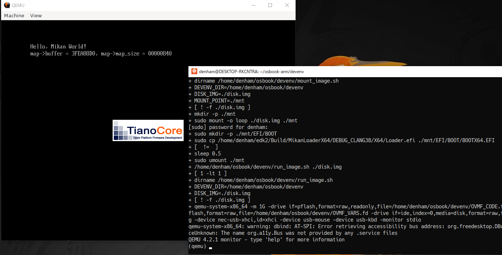

+++
title = "輪講"
outputs = ["Reveal"]
[reveal_hugo]
theme = "moon"
slide_number = true
[markup.highlight]
codeFences = false
+++

# 輪講 第3回

---


## 概要
- 一般に，「言語の限界だと思われているもの（思い込み・暗黙の前提）」を検証し，定量的に評価する

---

## アプローチ
- 「関数型言語HaskellでOSを自作する」
    - 関数型言語Haskellを用いて小規模なOSを設計・自作し，C言語を用いて自作した場合と比較・検証する

---

## 進捗
- x86のエミュレータでOSを起動し，メモリマップを描画するまで(参考書/ゼロからのOS自作入門~3章)
  - 今後はアセンブラのコードやブートローダをARMv6向けに移植し，実機(Arudino uno)で起動する


---

- Haskellを学習

---

## Haskellと関数型言語について

---

### そもそも関数とは何か？

- 関数プログラミングにおける関数とは  
**「与えられた入力の値のみから出力となる値をただ1つ決める規則」**
からなるもの  
    - 関数は，いつ，どのように使っても，同じ数値を与えれば同じ文字列表現が得られる  

---

### 例1
```py
# time.py
# 関数ではない
# currentを実行する度に得られる結果が違う
import time

def current
    return time.time()
    # 
    与えられた入力値以外から出力が決まる
```

---


### 例2

```c
// 関数
// show.cpp
// n=1 :oss="1", n=2 : oss="2",...
std::string show(const int n) {
    std::ostringstream oss;
    oss << n;
    return oss.str();
}
```

---

### 例3

```py
# 関数
# Python total.py
# numbers.add(0.5),numbers.add(1.5)...
# >>> np.sum(numbers)
# 2.0
def total(numbers)
    return np.sum(numbers)
```

---

### 関数型言語Haskellの特徴

- 純粋関数型プログラミング言語  
- 副作用を持たない  
- 遅延評価  
- 型推論を持つ静的型付き言語  

---

### 純粋

- 純粋(pure)とは，同じ式はいついつ評価しても同じ結果になる**参照透過性**という性質を持つこと  

---

### 例

```c
// 参照透過ではない変数
volatile int *foo = 0xDEADBEEF;
```

- メモリ0xDEADBEEF番地にマップされたハードウェア信号をリードするための準備を意味する
- `*foo` 式により信号状態を取得できるが，呼ばれるたびに結果が異なる可能性がある
    - 値を参照するたびに外部との入出力を発生させるため  

---

```c
// 参照透過な変数
const int foo = 0;
```

```c
// 参照透過な関数
int foo() {
    return 1;
}
```

---

### 副作用[^1]

- プログラミングにおいて，**状態**を参照し，あるいは**状態**に変化を与えることで，次回以降の結果にまで影響を与える効果のことを副作用(side effect)という．  

**例**  
- 代入，入出力  

[^1]: グローバル関数の参照/書き換えは最も厄介な副作用  

---

### 遅延評価

- プログラミングにおける評価戦略[^2]の規則の一つ
- 積極評価では引数は渡される前に評価される
- 遅延評価では必要になるまで評価されない

[^2]: どのような順番で式を評価するか

---

### 例

```c
// 「たらい回し関数」と呼ばれるもの
int tarai(int x, int y, int z) {
    return (x<=y)
        ? y
        : tarai(
            tarai(x-1, y, z),
            tarai(y-1, z, z),
            tarai(z-1, x, y));
}
```

- xがyより小さい場合,zの値は必要とされずに結果が決まる
- 積極評価の言語で実装すると，引数が渡される前にzの分の計算をしてしまうため遅くなる
- 遅延評価の言語で実装すると不要なzは評価されず，計算が省略されるため速くなる

---

### 静的型付けと動的型付け
- 型検査をコンパイル時に行うのが静的型付け
- 型検査を実行時に行うのが動的型付け

| 言語 | 強さ | 型付け |
|:-------|:--------:|-------:|
|C       |弱い         |静的       |
|Java       |強い         |静的       |
|Hasell       |強い         |静的       |
|Python       |弱い         |動的       |
|JavaScript       |強い         |動的       |
|Ruby       |強い         |動的       |

---

### 関数型言語は何に向いているのか？

- 群論・圏論といった数学方向への抽象化[^3](abstraction)
    - 明確に「向いている」といわれている
    - 評価の基準は
        - 多くの問題に対して，汎用的に適用できる
        - 抽象化後の世界で行える操作が豊富である
    こと[^4]

[^3]: コンポーネントやモジュールの再利用性を高めたり，実装とインターフェースを切り離して，プログラムを柔軟に保つこと
[^4]: 群論・圏論は数学的な構造を扱うための分野．関数型言語の数学問題への抽象化は，この2点を満たしている

---

### 次週までにやること

- 自作OS
  - 環境をARMv6向けに移植し，実機で起動テストをする

- Haskell
  - 文法の学習