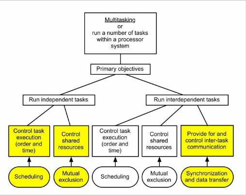
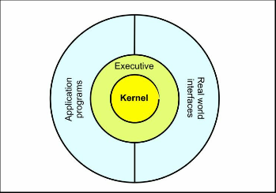

+++
title = "輪講"
outputs = ["Reveal"]
[reveal_hugo]
theme = "Beige"
slide_number = true
[markup.highlight]
codeFences = false
+++

## Real Time Operation System

#### 2022-06-16

---

## Key bindings

- RTOS（Real Time Operating System）
  - An OS for building a system that can execute processes within the required time (= real-time system).
  - The key point is "satisfying time constraint conditions.

---

## BackGround

<!-- 大型OSは1950年代に登場しました．
しかし，1980年代の半ばまで，マイコンOSは以下の理由から定着しませんでした．
概念，構造，機能，インターフェース
そして，組み込みプログラミングをする人たちの中に，OSを理解している人が少なかったためです． -->

Large OSs appeared in the 1950s.  
However, until the mid-1980s, microcomputer OSs did not take root for the following reasons

- Concepts, structures, functions, and interfaces.
- The concept, structure, functionality, and interface of the OS, and because few people doing embedded programming understood the OS.

---

<!-- しかし現在では，事情が異なります
商用の32bitの複合マイコンが普及していて，誰もが手軽に入手できます．
そしてこれらは(And these are)，これらは低コストで高性能なデバイスであり、豊富なオンチップメモリと周辺機能を内蔵しています． -->

Today, however, the situation is different.

- Commercial 32-bit composite microcontrollers are widely available and easily accessible to everyone.
  - low-cost
  - high-performance devices
  - rich on-chip memory and built-in peripheral functions.

---

<!-- しかし，そもそも，「できる」こと=「やるべき」ことなのか？
・なぜRTOSを採用するのか？
・RTOSが適合する設計とはどのようなものなのか？
このような判断をするために，私たちは基本的な組み込みシステムのソフトウェアにおける実用的な設計手法の基礎を学ぶ必要があります．
 -->

But, in the first place, **does "can" = "should"?**  
**Why should RTOS be adopted?**  
**What kind of design is RTOS compatible with?**  
To make such decisions, it is necessary to learn the basics of practical design techniques in basic embedded system software.

---

## To produce high quality software

<!-- 高品質なソフトウェアの条件とは何でしょう？
本書では，以下のように定義されています． -->

From the start, what are the requirements for high-quality software?
In this document, it is defined as follows.

```md
1.'functional' correctness.
2.'temporal' correctness.
3.Its behaviour should be predictable.
4.Its behaviour should be consistent.
5.low complexity.
6.static analysis.
7.dynamic analysis.
8.Run-time performance should be predictable.
9.Memory requirements should be predictable.
10.The code can, if needed, be shown to conform to relevant standards.
```

---

<!-- これらの原則を，次のようなリアルタイムシステムに適用するとして，ソフトウェア開発者はどのようなことを考えるべきでしょうか？ -->

What should software developers consider when applying these principles to real-time systems such as the following?

---

<!-- 例えば，液体の流量を変化させて温度を制御するシステムを考えてみます． -->

For example, consider a system that controls temperature by varying the flow rate of a liquid.

```md
Temperature sensore-->Contorol computer-->Flow control actuator
```

---

<!-- このようなシステムで，ソフトウェアが行うべきことは，データ収集と信号の線形化，スケーリング，制御計算，アクチュエーターの駆動です．しかし，SIL規格規格によって，割り込み処理は禁止されています． -->

In such a system, the software should perform data acquisition, signal linearization, scaling, control calculations, and actuator driving.

**However, the SIL standard prohibits interrupt processing.**

---

Therefore, to handle time in this system, the following description is used.

```c
DelayUntilTime = xx millseconds;
```

---

## Basic features of real-time operating systems

<!-- このように，組み込みプログラミングでは，高級言語の知識だけでなく，マシンのハードウェアや機能に関する専門的な知識を持っている必要があります．
Thus, embedded programming requires not only knowledge of high-level languages, but also specialized knowledge of the machine's hardware and functionality. -->

What are the basic functions of a real-time OS?
A timer times out. How can software know what happens in real time in the computer world, such as when a power switch is pressed?
There are two ways. `Polling` or `hardware interrupt`.

<!-- リアルタイムOSの基本機能は何でしょうか．
タイマーがタイムアウトした．電源スイッチが押されたかなど，コンピューターの世界でリアルタイムに起こる出来事を，ソフトウェアはどうやって知ることができるのか？
それには2つの方法があります．ポーリングか割り込みです． -->

---

<!-- 割り込みは，特定のソフトウェアのコードを実行するエンジンと考えることができます．
割り込みを利用することで、複数のタスクを「同時に」実行することができます．
しかし，「割り込み」はソフトウェア開発者が扱うには，非常に複雑な概念です．
オペレーティングシステムの中心的な機能は、コード作成者からこの負担を取り除くことです。OSはプログラマーからコンピュータの複雑な部分を取り除き、プログラマーを本来の仕事に集中できるようにします。 -->

Interrupts can be

- thought of as engines that execute specific software code.
- used to execute multiple tasks "simultaneously".

However, **"interrupts" are a very complex concept for software developers to deal with.**

<!-- The central function of an operating system is to remove this burden from the code author; the OS removes the complexity of the computer from the programmer, allowing the programmer to focus on his or her primary task. -->

---

Hardware and OS software considerations include.

```md
1. Task structuring of programs.
2. Task implementations as logically separate units (task abstraction).
3. Parallelism (concurrency) of operations.
4. Use of system resources at predetermined times.
5. Use of system resources at random times.
6. Task implementation with minimal hardware knowledge.
```

---

Commercial operating systems are extremely unstable in mainframe environments. The number, complexity, and scale of tasks to be processed at any one time is unknown.

---

In embedded applications, tasks are well defined.  
Therefore, the processor must be able to handle the total computer load on a fairly specific timescale.
The operating system must be **efficient, and reliability of operation is of paramount importance**.

---

<!-- 市販のOSは，メインフレームの環境は非常に不安定です．一度に処理するタスクの数、複雑さ、規模が未知数です．

組み込みアプリケーションでは、タスクの定義が明確です。そのためプロセッサは、コンピュータの総負荷量をかなり具体的なタイムスケールで処理できなければなりません。
したがって、OSは効率的である必要があるし，動作の信頼性が最も重要です。
例えば，この例では、3つの主要なタスクがあります。JPT制御、フライトレコーダーインターフェイス、パイロットインターフェイスです．
それぞれを別々のプロセッサで執行することはマルチプロセッサといいます．
しかし，これは高コストだし，複雑で，技術的に行き過ぎています． -->

In this example, there are three main tasks: the JPT control, the flight recorder interface, and the pilot interface.
Executing each on a separate processor is called multiprocessor.
However, this is expensive, complex, and technically overkill.



---

<!-- それぞれを別々のプロセッサで実行する、つまりマルチプロセッシングが可能です。このような小さなシステムでは、これは高価で複雑であり、技術的に行き過ぎとなります。そのため、1つのプロセッサのみを使用します。
注意　シングルプロセッサのマルチタスク設計を「マルチタスク」システムといい，マルチプロセッサとは区別します． -->

Each can be run on a separate processor, i.e., multiprocessing. In such a small system, this would be expensive, complex, and technologically excessive. Therefore, only one processor is used.

<!-- Note A single-processor multitasking design is called a "multitasking" system and is distinguished from a multiprocessor. -->

---

<!-- いま，3つの独立した、しかし相互に依存するタスクが存在しています．
これを解決するのが，OSの「マルチタスクシステム」です．
「いつ」「何のために」タスクを実行するかを決めなければなりません。「タスクスケジューリング」です。 -->

Now there are three independent but interdependent tasks.  
The solution to this problem is a **"multitasking system"** for the OS.  
The task scheduling is to decide **"when"** and **"for what"** the task is to be executed.  
This is **"task scheduling"**.

---

<!--
タスク間で共有される資源の使用を監視し，その資源の損傷や破損を防ぐ「相互排除」を行わなければなりません．タスクはお互いに「話す」ことができなければならないので、通信設備が必要になります 「同期とデータ転送」．
例えば、シングルボードのデジタルコントローラーに、複数の独立した制御チャンネルを実装します。これらのタスクは、互いに通信する必要なく、業務を進めることができます。 -->

Tasks must monitor the use of resources shared between them and perform "mutual exclusion" to prevent damage or corruption of those resources.  
Tasks must be able to "talk" to each other, thus requiring communication facilities **"synchronization and data transfer."**

<!-- For example, implement several independent control channels on a single-board digital controller. These tasks can proceed without the need to communicate with each other. -->

---

## Finally

An OS is defined as "a set of software products that jointly control system resources on a computer and the processes that use those resources.
Embedded OSs are smaller and simpler than mainframe OSs.  
Finally, see the figure below.



<!--
An OS is defined as "a set of software products that jointly control system resources on a computer and the processes that use those resources.
Embedded OSs are smaller and simpler than mainframe OSs.
See the figure below.
Programmers use RTOS software by calling resources via the outer ring portion, the application programming interface (API).
In an embedded OS, programmers do not need hardware or low-level programming knowledge to handle system functions.
The safe operation of the system depends entirely on the executive and kernel design.

OSとは「コンピュータ上のシステム資源とその資源を利用するプロセスを共同で制御するソフトウェア製品の集合」であると定義されています。
組込み型OSは、メインフレーム型に比べて小型で単純です。
以下の図を見てください．
プログラマーは外側のリングの部分，アプリケーションプログラミングインターフェース（API）を介してリソースを呼び出すことで、RTOSソフトウェアを使用します．
組み込み型OSでは，プログラマーがシステム機能を扱うために，ハードウェアや低レベルのプログラミングの知識は必要ありません．
システムの安全な動作は、エグゼクティブとカーネルの設計に完全に依存します。 -->

---

Fin.
