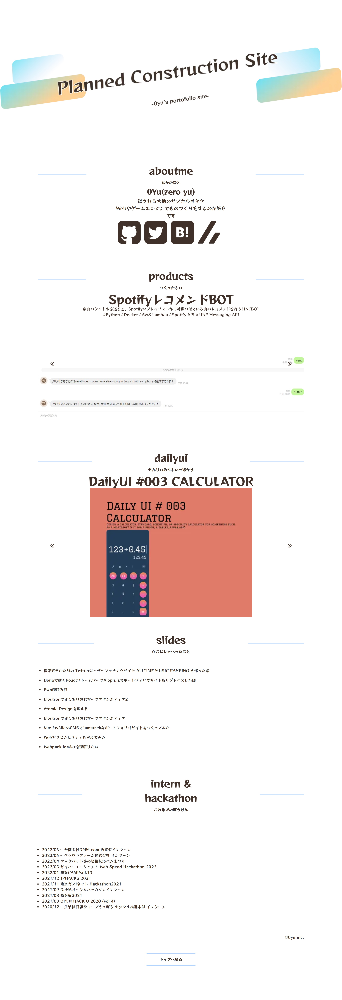
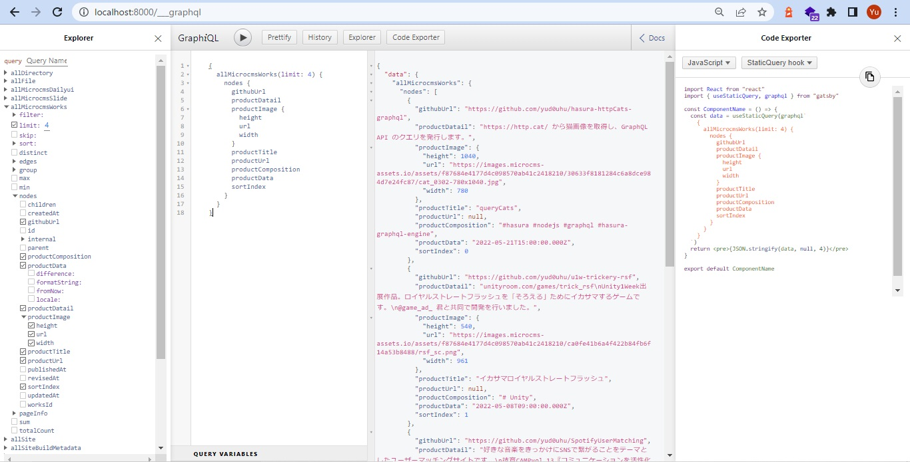
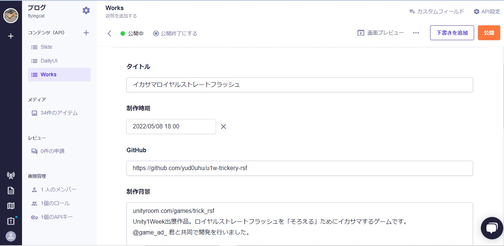

+++
title = "GraphQLで遊んでみた"
outputs = ["Reveal"]
[reveal_hugo]
theme = "sky"
slide_number = true
[markup.highlight]
codeFences = false
+++

## GraphQLで遊んでみた
#### 2022-06-11
#### ちとせゆるい勉強会

---

## やったこと

1. 🐈REST API(HttpCats)をGraphQL APIに変換するサーバー建ててみた

2. 🏠GatsbyJS × MicroCMS × GraphQLでポートフォリオサイトを作った

---

### 🐈Hasura GraphQL Engine がめちゃくちゃ便利というお話です

---

### 🐈Hasura GraphQL Engineとは？
Postgres上にDBを作ると，GraphQL APIを爆速で構築してくれる便利エンジン

---

### 🐈[公式ドキュメント](https://hasura.io/docs/latest/graphql/core/getting-started/docker-simple/)
に従ってDockerでHasuraを起動する

```sh
# 作業用ディレクトリにdocker-compose.yamlを追加する
$ wget https://raw.githubusercontent.com/hasura/graphql-engine/stable/install-manifests/docker-compose/docker-compose.yaml
# Hasura GraphQL engineを起動する
$ docker-compose up -d
# コンソールにアクセスする
$ http://localhost:8080/console
```

---

### 🐈CREATE TABLEしてみる


---

### 🐈APIからデータを取得し，Posgres内に格納する

```js
// 各カラムに対応する情報と，https://http.cat/ から取得した画像をinsertする
const axios = require("axios");
const { Client } = require("graphqurl");
const statuses = require("./lib/statuses.js");

const client = new Client({
  endpoint: "http://localhost:8080/v1/graphql",
  headers: {
    "Content-Type": "application/json",
    "X-Hasura-Access-Key": XXXXXXXXXXXXXXXX,
  },
});
statuses().forEach(async (value) => {
  await axios
    .get(`https://http.cat/${value.code}.jpg`, {})
    .then((result) => {
      const createStatus = `mutation insert_status (
            $status_code: Int,
            $status_image: String
            $status_message: String
        ) {
            insert_status ( objects: [
                    {
                        status_code: $status_code,
                        status_image: $status_image,
                        status_message: $status_message,
                    }
                ]) {
                affected_rows
                    returning {
                        status_code
                        status_image
                        status_message
                    }
                }
            }`;

      const statusDatails = {
        status_code: value.code,
        status_image: `https://http.cat/${value.code}.jpg`,
        status_message: value.message,
      };

      client.query(createStatus, statusDatails).catch((error) => {
        console.log(error);
      });
    })
    .catch((code) => {
      console.error("error:" + code);
    });
});
```

---

### 🐈graphiQLコンソールからクエリを叩いてみる


---

### 🏠GatsbyJS × MicroCMS × GraphQLでポートフォリオサイト(V5)を作った

---



---

### 🏠使用技術


---

### 🏠GatsbyJS公式の提供するtsスターターがあるので使う

```sh
$ npx gatsby new PortofolioSite https://github.com/jpedroschmitz/gatsby-starter-ts
```

---

### 🏠MicroCMS公式の提供するpluginを入れる

```sh
$ yarn add gatsby-source-microcms
```
---

### 🏠GraphQLの型定義について

- 先月リリースされた[GatsbyJSv4.15](https://www.gatsbyjs.com/docs/reference/release-notes/v4.15/#graphql-typegen)でGraphQL Typegenが正式に標準サポートされた
- GraphQL のスキーマやクエリから TypeScript の型定義を自動生成してくれる
- v4.14で試験的にサポートされていた機能

```js
// gatsby-config.js
module.exports = {
  graphqlTypegen: true,
}
```

---

### 🏠package.jsonを見てみる

```js
{
  "name": "gatsby-starter-ts",
  "description": "A TypeScript starter for Gatsby that includes all you need to build amazing projects",
  "version": "1.0.0",
  "private": true,
  "author": "João Pedro Schmitz <hey@joaopedro.dev> (https://joaopedro.dev)",
  "license": "MIT",
  "keywords": [
    "gatsby",
    "starter",
    "typescript"
  ],
  "scripts": {
    "start": "gatsby develop",
    "build": "gatsby build",
    "serve": "gatsby serve",
    "clean": "gatsby clean",
    "type-check": "tsc",
    "lint": "eslint --ignore-path .gitignore \"src/**/*.+(ts|js|tsx)\"",
    "format": "prettier --ignore-path .gitignore \"src/**/*.+(ts|js|tsx)\" --write",
    "postinstall": "husky install",
    "test": "jest",
    "commit": "cz",
    "storybook": "start-storybook -p 6006",
    "build-storybook": "build-storybook"
  },
  "lint-staged": {
    "./src/**/*.{ts,js,jsx,tsx}": [
      "eslint --ignore-path .gitignore --fix",
      "prettier --ignore-path .gitignore --write"
    ]
  },
  "dependencies": {
    "@chakra-ui/gatsby-plugin": "3.0.0",
    "@chakra-ui/icons": "2.0.2",
    "@chakra-ui/layout": "2.0.1",
    "@chakra-ui/react": "2.1.2",
    "@emotion/react": "11.9.0",
    "@emotion/styled": "11.8.1",
    "@fontsource/reggae-one": "4.5.9",
    "dotenv": "16.0.1",
    "esbuild": "0.14.42",
    "framer-motion": "6.3.4",
    "gatsby": "4.15.0",
    "gatsby-source-microcms": "2.0.0",
    "react": "18.1.0",
    "react-dom": "18.1.0",
    "react-slick": "0.29.0",
    "recoil": "0.7.3",
    "storybook-addon-designs": "6.2.1",
    "tsconfig-paths-webpack-plugin": "3.5.2"
  },
  "devDependencies": {
    "@babel/core": "^7.18.2",
    "@babel/preset-react": "7.17.12",
    "@babel/preset-typescript": "7.17.12",
    "@commitlint/cli": "17.0.0",
    "@commitlint/config-conventional": "17.0.0",
    "@storybook/addon-actions": "^6.5.6",
    "@storybook/addon-essentials": "^6.5.6",
    "@storybook/addon-interactions": "^6.5.6",
    "@storybook/addon-links": "^6.5.6",
    "@storybook/addon-postcss": "2.0.0",
    "@storybook/builder-webpack5": "^6.5.6",
    "@storybook/manager-webpack5": "^6.5.6",
    "@storybook/react": "^6.5.6",
    "@storybook/testing-library": "^0.0.11",
    "@testing-library/dom": "8.13.0",
    "@testing-library/jest-dom": "5.16.4",
    "@testing-library/react": "13.2.0",
    "@testing-library/react-hooks": "8.0.0",
    "@types/jest": "27.5.1",
    "@types/node": "16.11.36",
    "@types/react": "18.0.9",
    "@types/react-dom": "18.0.5",
    "@typescript-eslint/eslint-plugin": "5.27.0",
    "@typescript-eslint/parser": "5.27.0",
    "babel-jest": "28.1.0",
    "babel-loader": "^8.2.5",
    "babel-preset-gatsby": "2.14.0",
    "commitizen": "4.2.4",
    "cz-conventional-changelog": "3.3.0",
    "esbuild-register": "3.3.3",
    "eslint": "8.16.0",
    "eslint-config-prettier": "8.5.0",
    "eslint-config-standard": "17.0.0",
    "eslint-import-resolver-typescript": "2.7.1",
    "eslint-loader": "4.0.2",
    "eslint-plugin-import": "2.26.0",
    "eslint-plugin-jest": "26.2.2",
    "eslint-plugin-jsx-a11y": "6.5.1",
    "eslint-plugin-n": "15.2.0",
    "eslint-plugin-prettier": "4.0.0",
    "eslint-plugin-promise": "6.0.0",
    "eslint-plugin-react": "7.30.0",
    "eslint-plugin-react-hooks": "4.5.0",
    "husky": "8.0.1",
    "identity-obj-proxy": "3.0.0",
    "jest": "28.1.0",
    "jest-environment-jsdom": "28.1.0",
    "lint-staged": "12.4.1",
    "prettier": "2.6.2",
    "ts-jest": "28.0.2",
    "typescript": "4.6.4"
  },
  "config": {
    "commitizen": {
      "path": "cz-conventional-changelog"
    }
  }
}
```

---

### 🏠クエリを叩いてみる

```js
query MyQuery {
  allMicrocmsWorks(limit: 10) {
    edges {
      node {
        worksId
      }
    }
  }
  microcmsWorks {
    productUrl
    productImage {
      height
    }
  }
}
```

---

### 🏠クエリを叩いてみた
- レスポンスだけでなく，コンポーネントでクエリの結果を使用するためのコードを生成してくれる



---



👇


---

### 🏠クエリを扱う便利hook達

大きく[ページクエリ](https://www.gatsbyjs.com/docs/how-to/querying-data/page-query/)と[コンポーネントクエリ](https://www.gatsbyjs.com/docs/how-to/querying-data/use-static-query/)の2種類が提供されている
  - page query
  - useStaticQuery /StaticQuery

---

### 🏠違いについて

- page queryはpagesディレクトリ直下のコンポーネントからのみデータを取得できる(index.jsや404.jsなど)
  - クエリに変数を扱える
- 一方，useStaticQueryでは「どのコンポーネントでも」GraphQLを介してデータを取得できる
  - 状態管理が楽

---

### 🏠Chakra UI について

- CSS in JSなReactのUIコンポーネントライブラリ
- スタイルをUtility Propsとして直接渡せる
  - Tailwind inspired
- [Styled System](https://styled-system.com/)が豊富なCSSプロパティを用意してくれている

```js
<Box
  fontSize={4}
  fontWeight='bold'
  p={3}
  mb={[ 4, 5 ]}
  color='white'
  bg='primary'>
  Hello
</Box>
```

---

### 🏠Chakra UI のここがよい

- 型保護されているので，素でVSCodeの補完が効く
- Style付きコンポーネントの種類が豊富
  - 同一の要素を等間隔で並べるのは`<Stack>`コンポーネントが便利
  - `<Stack>`は`<Button>`コンポーネントにいい感じのspaceがついたコンポーネント

|        |方向 | align| 
| ---    | --- | ---  | 
| Stack  | 縦  | 左   | 
| HStack | 横  | 中央 | 
| VStack | 縦  | 中央 | 

---

### 🏠つらかったこと

- レスポンシブのデザインで沼る
- LightHouseのスコアが低い
  - 原因はシングルぺージに対して画像の量が多いなど
    → 画像はWebPとnext/imageで軽量化
  - チューニングしたい...

---


### つくったもの

- 🐈[https://github.com/yud0uhu/hasura-httpCats-graphql](https://github.com/yud0uhu/hasura-httpCats-graphql)
- 🏠[https://planned-construction-site.vercel.app/](https://planned-construction-site.vercel.app/)
- 🏠[https://github.com/yud0uhu/PortofolioSiteV5](https://github.com/yud0uhu/PortofolioSiteV5)

---

### ご清聴ありがとうございました！！